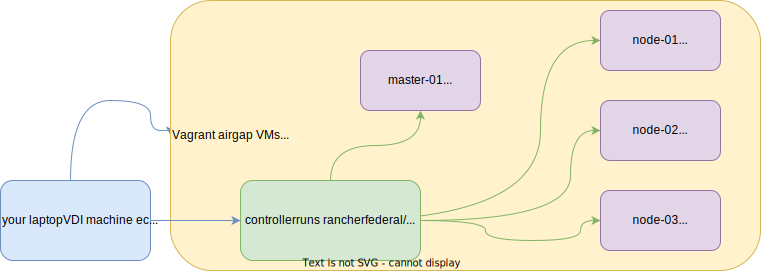

# WIP: vagrant-rke2-airgap

An attempt to install and play with [Rancher RKE2 air-gapped](https://github.com/rancherfederal/rke2-ansible) installation

#### WIP STATUS: accesing issues with full airgap

## Usage

```
vagrant up
```

To skip provisioning and just bring up the VMs:

```
NO_TRIGGERS=true vagrant up
```

To skip configuring airgap:
```
ANSIBLE_AIRGAP=false vagrant up
```

## Requirements

- vagrant
- virtualbox
- ansible

## TLDR;


Vagrant will perform the following:
- provision VMs as defined in [vagrant.yaml](./vagrant.yaml)
- execute ansible on your machine:
  - pre-onfigure vagrant VMs
  - prepare RKE2 airgap install with rke2 linux images
  - generate `my-cluster` inventory for rke2-ansible
- execute ansible on air-gapped controller machine:
  - install rke2 on all air-gapped cluster VMs

## Accessing RKE2 from your host
1. An alias to `kubectl` is created on a master server
    ```
    alias kubectl='sudo /var/lib/rancher/rke2/bin/kubectl --kubeconfig /etc/rancher/rke2/rke2.yaml'
    ```

1. Port 6443 is forwarded by default from master-01 to localhost
1. RKE2's `/etc/rancher/rke2/rke2.yaml` kubeconfig file is saved to `/tmp/rke2-ansible.yaml` \
   Using this file is sufficient to connect from localhost with your favourite k8s tool.

## TODOS:
1. Support more linux os (currently only centos7 😆 )
1. Support private repository install method
1. _**This is a Work In Progress**_ and full airgap hasn't been configured yet as I'm finding issues and create PRs to rancherfederal repo

## Issues with airgap found so far needing internet when it shouldn't
rke2-ansible code:
1. installing yum package lsb-core 
1. configuring yum rke2 repos via github

## Stuff used

* intel OSX ventura (my host OS) - should easily run on your Linux laptop (or maybe even on Windows)
* vagrant 2.3.4
* virtualbox 7.04
* ansible 2.14.1

## Notes
1. Since there's a [config.yaml bug in rancherfederal/rke2-ansible](https://github.com/rancherfederal/rke2-ansible/issues/138) at present the git repo being pulled is using my rke2-ansible fork

1. Virtualbox on mac by default might not allow you to create required interfaces.\
   Try creating a following file `/etc/vbox/networks.conf`
   ```
   * 10.0.0.0/8 192.168.0.0/16
   ```

1. There might be funky things going on if you use M1/M2 Apples
